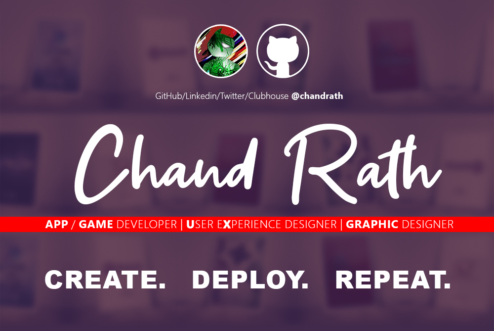

### Hello there 👋

  

<h1 align="center">Hi, Its <a href="https://www.twitter.com/chandrath">Chand Rath</a>!</h1>
<h1 align="center">Welcome to my GitHub Profile</h1>

  

  <strong><a href="https://www.github.com/chandrath">GitHub</a></strong> |
  <strong><a href="https://twitter.com/chandrath">Twitter</a></strong> |
  <strong><a href="https://www.linkedin.com/in/chandrath">LinkedIn</a></strong> |
  <strong><a href="https://www.clubhouse.com/@chandrath">Clubhouse</a></strong>

 App / Game Developer | User Experience Designer | Graphic Designer 

<!--
**chandrath/chandrath** is a ✨ _special_ ✨ repository because its `README.md` (this file) appears on your GitHub profile.

Here are some ideas to get you started:

- 🔭 I’m currently working on ...
- 🌱 I’m currently learning ...
- 👯 I’m looking to collaborate on ...
- 🤔 I’m looking for help with ...
- 💬 Ask me about ...
- 📫 How to reach me: ...
- 😄 Pronouns: ...
- ⚡ Fun fact: ...
-->

